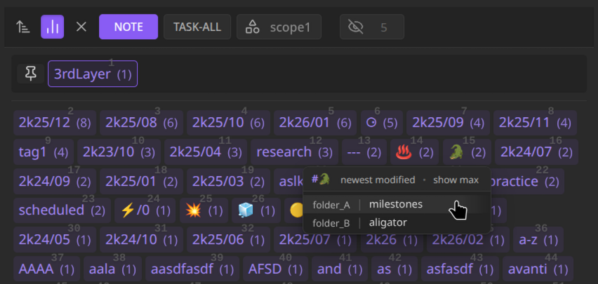

# flat-tag-view-obsidian-plugin

Displays tags in a flat, space-separated format with multi-select filtering, sorting, and search integration.

## Flat Tag View Pane / Main features

- **Core feature: select multiple tags and filter FTV view with `Ctrl-click`**
- Add negative selection with `Shift-click` (do not show files with this tag)
- Pin / Unpin commonly accessed tags to/from top of the view with `Alt-click`
- **Modes:** `Note` / `Line` / `Tasks-All` / `Tasks-Todo` / `Tasks-Done`
- **Visual Mode Indicators:** Tags display superscripts based on context (`ℓ`, `τ`, `☐`, `✓`).
- **Keyboard-centric navigation:** - search for and select tags using only keyboard
- **Scopes:** Preconfigure include/exclude folder rules and toggle them from a dropdown menu.
- Sort tags `A-Z` or `By usage`
- Setting to hide infrequently used tags (`Frequency cutoff`)
- Clear tags selection with one click (x) or a hotkey
- Simple search for tags with clear button
- **Preview Files/Tasks List:** tag mouse hover shows a pop-up with a list of files/tasks that contain that tag.
- Configurable hotkeys
- Global Mute: right-click a tag in FTV pane to globally decommission it (replaces `#tag` with `#%tag` across vault)
- Automatically focuses search pane and sends selected tags to it
- Performant on very large vaults (+10k notes, +5k tags)

### Filter Modes (Note / Line / Task)
By default, selecting multiple tags in FTV works on a **Note-level** basis. Clicking the `Note` and `Task-All` buttons allows you to tighten the scope of your search to find tags that co-occur on the exact same line or within specific task types.
  
Click the Task-modes button to instantly toggle between `Task-All` and `Task-Todo` tasks. **Long-press** it (1 second) to jump straight to `Task-Done`.

| Mode          | Indicator             | Behavior                                                                                  |
| ------------- | --------------------- | ----------------------------------------------------------------------------------------- |
| **NOTE**      | `(#)`                 | Standard. Shows tags that co-occur anywhere within the same file.                         |
| **LINE**      | `(#``ℓ``)` | Line mode. Only shows tags that co-occur on the exact same line of text.                  |
| **TASK-ALL**  | `(#``τ``)` | Only shows tags that co-occur on a line formatted as a task.                              |
| **TASK-TODO** | `(#``☐``)` | Only shows tags that co-occur on an incomplete task line (`- [ ]`).                       |
| **TASK-DONE** | `(#``✓``)` | Only shows tags that co-occur on a completed task line (`- [x]`, `- [!]`, `- [>]`, etc.). |

#### _Notes on Task Modes_
1. If you have a `#tag` used 8 times in a note (once in plain text, plus 7 tasks marked with this tag, two of which are done and five are to-do), FTV will show:
- `#tag (1)` in Note mode
- `#tag (8``ℓ``)` in Line mode
- `#tag (7``τ``)` in Task-All mode
- `#tag (5``☐``)` in Task-Todo mode
- `#tag (2``✓``)` in Task-Done mode

2. FTV's task modes are strictly line-based. Tags placed on indented lines underneath a task will not be associated with that parent task. Only tags sitting on the exact same line as the task checkbox are counted.

3. `Task-Done` matches Obsidian's native search behavior: it captures any completed state, including custom theme checkboxes (e.g., `- [x]`, `- [!]`, `- [A]`). `Task-Todo` strictly looks for an empty space (`- [ ]`).

4. Switching between note, line, and task modes retains your selected tags. Tags with zero results in the new mode stay pinned with a (0) count so you don't lose your filter context. This also applies while switching scopes.

### Scopes (Folder Filtering)
Scopes allow you to create preconfigured sets of folders to instantly narrow down your entire vault's tags to specific projects or areas.

- **Create Scopes in Settings:** Define rules by typing folder paths.
	- **Include / Exclude:** Use the `+` / `-` toggle next to a folder path to include it or explicitly exclude it.
	- Inclusions always include subfolders.
		- To exclude subfolder, add it as a separate excluding rule.
	- Exclusions always override inclusions.
	- Order of folder rules in a scope is irrelevant in processing rules.
- **Root-Only Filtering:** Use a single `/` exclude rule to ignore files living directly in the vault root in a scope.
- **Fast Switching:** Click the Scopes text in the FTV pane to open a dropdown menu and instantly switch between scopes. 

### Tag Shortcut Indexes

When the FTV pane is focused, visible tags are assigned live numeric index badges. Press the corresponding number(s) to instantly toggle that tag and filter. Tags are numbered 1, 2, 3… based on their current visible position on screen, recalculated on every filter, search, or scroll.

Single digit (1–9): fires after a 400ms pause, giving you time to type a second digit.
Multi-digit (12, 99…): type digits in quick succession within the 400ms window to target higher-numbered tags. The timer resets with each keystroke.
0: hard reset — clears both the active tag selection and the search box in one keystroke.
Space: toggles shortcut index mode on/off (hides/shows all badges). Useful when you need to search for digits in tag's name.

### On-Tag Mouse Hover Pop-ups

Switch `CapsLock` on or press and hold `Shift` while hovering over any tag in the FTV pane to instantly view a list of files containing that tag. The popup allows you to quickly open files (or `Shift-click` to open in a new tab) and includes inline controls to change sorting (A-Z vs. Newest modified) and the number of displayed results (5 / 10 / 20 / max). List is filtered as per current selection of tags. Setting sort and number of displayed files is persistent.

In any of `TASK` modes, by adding `Alt` to `CapsLock` or `Shift` you can see list of _tasks_ in a pop-up instead of files lists.

## Tag Insertion and Interaction (Editor)
Alt-clicking a word in the editor turns it into a tag. Alt-clicking an existing tag removes tag (#). Placement of newly created tags and removal of tags is configurable:
 
| Mode                    | Behavior                                                                                           |
| ----------------------- | -------------------------------------------------------------------------------------------------- |
| **SOL** (Start of Line) | Tag is inserted at the beginning of the line, sorted alphabetically with any existing leading tags |
| **INP** (In Place)      | The word under the cursor is converted to a tag in place                                           |
| **EOL** (End of Line)   | Tag is appended at the end of the line, before any `^block-id` suffix (also sorted as in SOL mode  |

The current mode is shown in the Obsidian status bar (this can be toggled off in settings). You can cycle through modes by clicking the status bar text, using the **Cycle Tag Placement** hotkey, or via direct SOL/INP/EOL hotkeys.
 
**Extra Shortcuts**
- `Ctrl-Alt-click` - **Send tag under cursor to FTV** - click a tag in the editor to immediately open the FTV pane, clear current selections, and select that tag. **This works in Reading View, too.**
- `Ctrl-Shift-Alt-click` - **Local Mute** - Instantly invalidate/revalidate tag under cursor by changing it to `#%tag` (and back to `#tag`).
- `Shift-Alt-click` - **Remove # in place** - Removes # always preserving text, regardless of location of a tag on a line and regardless of mode (SOL/INP/EOL)

_<small>These extra shortcuts/actions collide with Create/Open Tag Page function in Tag Wrangler plugin by PJ Eby</small>_

## Mobile Use
FTV works on Obsidian for Android and (probably) on iOS (not tested) without any extra configuration. A single tap selects a tag (or deselects it if it is the only active selection). A long press (~500 ms) activates multi-select on the tapped tag. Long press unselects a tag from multiple selection. To pin or unpin a tag on mobile, swipe the tag to the left. Manually move between FTV Pane and Search Pane. _ATM search sometimes is not properly sent to Search Pane - see Roadmap_

## Settings

| Area          | Setting                      | Description                                                                   |
| ------------- | ---------------------------- | ----------------------------------------------------------------------------- |
| Tags Pane     | Frequency cutoff             | Hides tags that appear fewer than N times in the vault                        |
| Tags Pane     | Clear pinned tags            | Removes all pinned tags from the top section                                  |
| Tags Pane     | Scopes                       | Create custom sets of included/excluded folders to dynamically filter the FTV |
| Tag insertion | Alt-click tag placement      | SOL / INP / EOL — where a newly created tag is placed                         |
| Tag insertion | Show placement in status bar | Displays SOL / INP / EOL in the Obsidian status bar                           |

## Hotkeys
All hotkeys are unbound by default and can be assigned in Obsidian Settings → Hotkeys.

| Command                                | Description                                           |
| -------------------------------------- | ----------------------------------------------------- |
| Open Flat Tags                         | Opens / reveals the FTV sidebar panel                 |
| Toggle sort (A-Z/Usage)                | Switches between alphabetical and usage sort          |
| Toggle mode (Note/Line)                | Switches between Note and Line mode                   |
| Cycle task mode (All/Todo/Done)        | Cycles through task filter modes                      |
| Clear tag selection in pane            | Clears all selected and excluded tags                 |
| Toggle Frequency Cut-off               | Toggles showing of less frequently used tags          |
| Clear FTV Search Box                   | Clears the tag search input                           |
| Cycle tag placement (SOL / INP / EOL)  | Cycles insertion placement mode and shows a notice    |
| Set tag placement (SOL / INP / EOL)    | Three separate hotkeys to directly set specific modes |
| Toggle scopes On/Off                   | Toggle between recently used Scope and Entire Vault   |
| Switch to 1st scope                    | Switch to first defined Scope (see Settings)          |
| Switch to 2nd scope                    | Switch to second defined Scope (see Settings)         |
| Create/remove tag at cursor            | Equivalent to Alt-click on word/tag in Editor         |
| Strip hash from tag at cursor position | Equivalent to Shift-Alt-click on tag in Editor        |
| Send tag at cursor to pane             | Sends tag under cursor to FTV and Search Pane         |
| Mute/Unmute tag instance at cursor     | Local Mute / Unmute tag in place (#tag ↔ #%tag)       | 

## Modifier-click Actions Summary

**In Flat Tag View (FTV Pane)**

- Ctrl-click → Add tag to selection (multi-select filter)
- Shift-click → Add tag as negative filter (exclude notes with this tag)
- Alt-click → Pin / Unpin tag to top of view
- Ctrl-Alt-click → Send tag from pane to last edited file (insert at last cursor position)
- Shift-hover / CapsLock-hover - Hover mouse over tag to show files list pop-up
- Shift-Alt-hover / CapsLock-Alt-hover - Pop-up showed on mouse over tag changes to tasks list in task modes
- Right-click → Global Mute - Converts all `#tag` → `#%tag` across vault (does not touch front matter tags)

**In Editor**
- Alt-click (word) → Create tag
- Alt-click (existing tag) → Remove # (SOL / INP / EOL mode dependent)
- Shift-Alt-click → Remove # but always preserve text (mode-independent)
- Ctrl-Alt-click → Send tag to FTV Pane and send it to Search Pane
- Ctrl-Shift-Alt-click → Local Mute / Unmute tag in place (#tag ↔ #%tag)

**In Reading / Preview Mode**
- Ctrl-Alt-click (tag) → Select tag in FTV Pane and send it to Search Pane (same as in Edit mode)

**Mobile (FTV Pane)**
- Tap tag → Select tag
- Long Press tag → Multi-select / deselect
- Swipe Left on tag → Pin / Unpin

## Keyboard Navigation & Search

You can navigate tags when the pane is focused (e.g., after using the "Open Flat Tags" hotkey or hovering mouse over the pane). 

### Fast Scrolling
When your tags are sorted A-Z, you can instantly jump to specific sections of your tag list:
- `Shift`+`Letter`: Instantly scrolls the view so tags starting with that letter appear at the top third of the pane.
- `CapsLock`+`Letter`: Performs the exact same jump as `Shift+Letter`
- `Shift+1`: Jump to the very top of the list.
- `Shift+0`: Jump to the very bottom of the list.

### Type-to-Search
You do not need to manually click the search box to filter tags. 
- When the FTV pane is focused and `CapsLock` is **OFF**, simply start typing.
- Normal letters instantly fill the search box and filter the visible tags on the fly.
- Press `Escape` or use a hotkey to clear the search and reset the view.

*(Note: If `CapsLock` is ON, typing letters will trigger the fast-scroll jumps instead of searching).*

---

## License
This software is licensed under the [MIT License](./LICENSE).

## _vibe coded w/ ai_
This code was written with use of multiple LLMs.

### roadmap
Flat Tag View - Where Tags Become First-Class Citizens. _Notes become secondary._

possibly / maybe / planned:
- high: main functions on/off switches in settings
- high/fix: erratic cursor jumps on tag creation/removal in editor
- high/fix: on mobile tags from ftv are not always properly sent to search pane
- high/fix: on mobile selected tags do not always get background highlight immediately
- mid: some way to temporarily bypass obsidian exluded folders
- low: recency of tags in use (?)
- no: virtualization of pane view

### ver. 0.7.0 changelog
- architecture: replaced per-render full DOM destruction with a pooled span recycler (speed improvements)
- architecture: moved note-mode vault filtering off the main thread into a web worker (ui stays responsive on 10k+ note vaults)
- added: tag shortcut indexes for keyboard-centric navigation
	- added: use space to escape and return to shortcuts to allow searching for digits in tag search
- added: clear tag search when number of selected tags changes
- added: clear tag selection and tag search with 0 when outside tag search box

### ver. 0.6.1 changelog
- fixed: task-modes files pop-up lists too many files

### ver. 0.6.0 changelog
- added: scopes for defining included/excluded folder rules
- added: tag's superscripts (`ℓ` for lines, `τ` for all tasks, `☐` for todos, `✓` for done)
- added: keyboard navigation in ftv pane
- added: help pop-up in ftv pane
- added: send tags from ftv to editor
- fixed: mouse clicks don't work in a second window (and hover editor)
- fixed: rebuilt line and task modes
- fixed: switching between note, line, and task modes retains your selected tags. tags with zero results in the new mode stay pinned with a (0) count so you don't lose your filter context. this also applies while switching scopes.
- fixed: wording, remove strange phrases (like change 'start drill down' to 'send tag to ftv')
- fixed: return solid background for pinned tags area 
- added: sort pinned tags az / usage together with all tags
- fixed: respect core obsidian excluded folders
- fixed: use sentence case in hotkeys descriptions and in settings

### ver. 0.5.0 changelog
- added: tag hover popups — press shift or capslock while hovering over a tag in ftv pane to see a quick list of matching files
- added: persistent inline tag hover popup controls to adjust popup sort mode (a-z or newest) and result count (5, 10, 20, max)
- added: shift-click a file inside tag hover popup opens it in a new tab
- fixed: typescript type checking errors

### ver. 0.4.1 changelog
- added: keep pinned tags area sticky
- added: hotkey for frequency cutoff on/off
- added: keyboard-only hotkey to create tag from selection / remove tag from selection
- added: keyboard-only hotkey remove tag preserving word
- added: keyboard-only hotkey mute/unmute tag under the cursor
- added: mouse over ftv gives focus to ftv (prereq for full keyboard-only acess to ftv)
- added: mouse away from ftv returns focus to editor (only if focus was given to ftv by mouse)
- added: use shift-letters or capslock+letters to scroll letter to 1/3 of ftv view
- added: use shift-1 to scroll to top, shift-0 to scroll to end of ftv view
- added: command 'open flat tags' now gives focus to ftv pane (opens & focuses ftv view)
- fixed: switching to task modes keeps previously selected mode (task-all,-todo,-done)

### ver. 0.4.0 changelog
- added: editor drill-down (ctrl-alt-click tag in editor to instantly filter it in ftv)
- added: local mute/unmute (ctrl-shift-alt-click) tag in editor to safely disable it as #%tag and re-enable it
- added: global mute (right-click tag in ftv to decommission it across entire vault)
- added: three new hotkeys to directly set sol, inp, or eol modes
- added: clickable status bar text to quickly cycle placement modes
- added: glow hint for non-empty ftv search box if unfocused
- fixed: improved a-z universal sorting
- fixed: handling touch and long touch on mobile
- quirky: on mobile tags from ftv are not always properly sent to search pane
- quirky: on mobile selected tags do not always get background highlight immediately
- (not much of an) easter egg: clicking the active sort button reveals total unique vault tag count

### ver. 0.3.0 changelog
- added: tag insertion and deletion
- alt-click tag insertion in editor (sol / inp / eol modes)
- modes: start of line, in place, end of line
- auto-detection: alt-click on existing \#tag removes it, on plain word creates it
- tag insertion preserves ^block-id suffix when placing tags at end of line
- newly inserted tags are sorted alphabetically with existing leading/trailing tags
- added: status bar indicator showing current tag placement mode (sol / inp / eol)
- added: "show placement in status bar" toggle in settings
- added: "cycle tag placement" hotkey command
- ~~added mobile long-press support for editor tag insertion~~

### ver. 0.2.2 changelog
- optimized view update logic (now ftv view updates quickly after current note changes)
- added ability to pin/unpin tags to top of flat-tag-view (with alt-click)
- added line-mode (check co-occurrence per line, tags have to be on same line to show up as co-occurring)
- added tasks-mode (same as line-mode, but works only with tasks)
- changed 'hide single use tags' to 'frequency cutoff' (hides tags occurring less than x times)
- fixed byUsage sorting within same frequency groups — ftag(2), atag(2), btag(2), dtag(1), ctag(1) are now sorted properly as atag(2), btag(2), ftag(2), ctag(1), dtag(1)
- added mobile version compatibility
