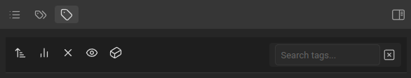

# flat-tag-view-obsidian-plugin

Displays tags in a flat, space-separated format with sorting options and search integration.

- select multiple tags and filter view with ctrl-click
- add negative selection with ctrl-shift-click (do not show files with this tag)
- pin/unpin commonly accessed tags to top of the view with alt-click
- modes: standard/line/tasks/tasks-todo/tasks-done
- sort tags a-z or by usage
- clear tags selection with one click (x) or hotkey
- setting to hide infrequently used tags (frequency cutoff)
- simple search for tags with clear button 
- configurable hotkeys
- automatically focuses search pane and sends selected tags to it

_vibe coded w/ ai_
_0.1.0 claude 3.7 sonnet / 4o_
_0.2.0 gemini 3.1 pro_

ver. 0.2.0 changelog
- optimized view update logic (now ftv view updates quickly after current note changes)
- added ability to pin/unpin tags to top of flat-tag-view (with alt-click)
- added line-mode (check co-occurance per line, tags have to be on same line to show up as co-occuring)
- added tasks-mode (same as line-mode, but works only with tasks)
- changed 'hide single use tags' to 'frequency cutoff' (hides tags occuring less than x times)
- added mobile version compatibility

